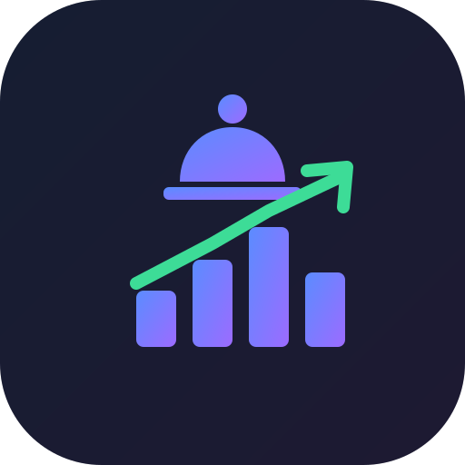

<div align="center">
  
  <h1>FloorTrades</h1>
  <p><em>Self-hosted tracker for U.S. congressional stock trading — auto-ranked by performance.</em></p>
</div>

Members of Congress must disclose their stock trades under the **STOCK Act**.
FloorTrades collects those public disclosures and turns them into a clean,
private, self-hosted dashboard you run on your own [Umbrel](https://umbrel.com).

- **Leaderboard** — politicians auto-ranked by the estimated excess return of their disclosed purchases vs. the market.
- **Trade flow** — biggest & most recent transactions, with late (post-45-day) filings flagged.
- **Politician pages** — photo, party, state, performance, trade history.
- **Ticker pages** — who in Congress is trading a given stock.
- **Search** across politicians and tickers, plus a small JSON API.

No accounts, no tracking, no paywall. Data refreshes daily (and on demand).

> ⚠️ Disclosures are self-reported in broad dollar ranges, so all figures are
> estimates. FloorTrades is for transparency & education — **not investment advice**.

---

## Quick start (local)

```bash
docker compose up --build
# open http://localhost:8000  (first load triggers a data refresh — give it ~30s)
```

## Run on Umbrel (Community App Store)

1. Build & push a multi-arch image to a registry you control:
   ```bash
   GH_USER=allusivepenny76 VERSION=1.0.0 ./scripts/build-and-push.sh
   ```
2. Replace `allusivepenny76` / `allusivepenny76` placeholders in
   `umbrel/floortrades/umbrel-app.yml` and `umbrel/floortrades/docker-compose.yml`.
3. Add 3 screenshots as `umbrel/floortrades/gallery/{1,2,3}.jpg`
   (see `umbrel/floortrades/gallery/README.md`).
4. Publish the **contents of the `umbrel/` directory** as the root of a public
   git repo (this is your community app store).
5. On your Umbrel: **Settings → App Store → Community App Stores → Add**, paste
   that repo's URL, then install FloorTrades.

To submit to the **official** Umbrel App Store later, open a PR adding the
`floortrades/` app folder to [`getumbrel/umbrel-apps`](https://github.com/getumbrel/umbrel-apps).

## Configuration

All optional — the app runs with zero config.

| Env var | Default | Description |
|---|---|---|
| `FLOORTRADES_DATA_DIR` | `/data` | Where the SQLite DB is stored (persisted) |
| `FLOORTRADES_REFRESH_HOURS` | `24` | Hours between automatic data refreshes |
| `FLOORTRADES_REFRESH_ON_START` | `true` | Refresh on boot if data is missing/stale |
| `FLOORTRADES_PROVIDER` | `kadoa` | Data provider (pluggable, see below) |
| `FLOORTRADES_BACKFILL` | `true` | Seed 2012–2020 Senate history on refresh |
| `FLOORTRADES_LEADERBOARD_MIN_TRADES` | `5` | Min scored buys to appear on the leaderboard |

## Data sources

The default `kadoa` provider pulls a free, **MIT-licensed** open dataset
([congress-trading-monitor](https://github.com/kadoa-org/congress-trading-monitor))
aggregated from the official **U.S. House Clerk**, **Senate eFD**, and **OGE**
financial-disclosure systems. No API key required.

The provider layer (`app/providers/`) is pluggable — add a class implementing
`Provider` (e.g. for FMP, Finnhub, or Quiver with an API key) and select it via
`FLOORTRADES_PROVIDER`.

**History & accumulation.** The primary feed exposes a rolling window of the
most-recent ~5,000 transactions. FloorTrades **accumulates** these — it upserts
by trade id and never deletes — so your local history grows for *both* chambers
the longer the app runs. On top of that, a **Senate deep backfill** seeds
2012–2020 history (from the Senate Stock Watcher archive) and merges it onto the
matching sitting senator's page. Disable with `FLOORTRADES_BACKFILL=false`.

Full line-by-line **House** history isn't available as a free structured feed
(it exists only as individual PDF filings on the House Clerk site), so deep House
history fills in over time via accumulation. There is also a small 2021–2022 gap
between the Senate archive and the primary feed's window.

## Architecture

Single container: **FastAPI** + **SQLite** + **APScheduler**, server-rendered
**Jinja** templates (no JS build step). Read-heavy and tiny — runs comfortably on
a Raspberry Pi. Multi-arch (`amd64` + `arm64`).

```
app/
  main.py        FastAPI routes + scheduler
  ingest.py      pull provider data → SQLite (transactional)
  providers/     pluggable data sources (kadoa default)
  queries.py     read queries
  db.py          schema + connection
  templates/     Jinja UI
  static/        CSS + icon
umbrel/          Umbrel community app store files
```

## License

MIT — see [LICENSE](LICENSE).
